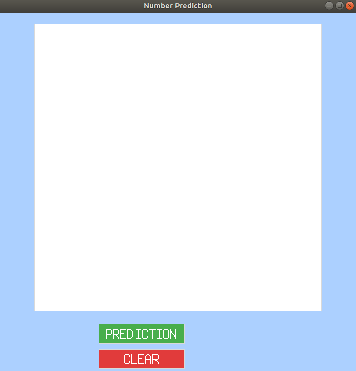
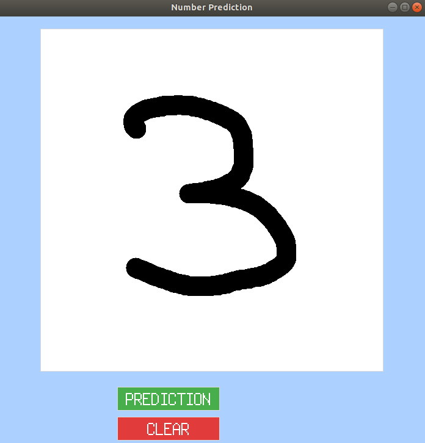

# classification_digits

Brief Simplon : Apprentissage supervisé - Classification

Par Thomas Chaigneau

---

- **1ère Partie :** Notebook sur la classification [avec Sklearn](./code_part1_classification.ipynb)

- **2ème Partie :** Notebook sur la classification [avec Tensorflow](./code_part2_tensorflow.ipynb)

---

Code de [l'interface](interface.py).

Lien vers la [sauvegarde](mnist_model) du modèle.

---

Instructions:

1. Ouvrir l'application

2. Dessiner un nombre entre 0 et 9

3. Cliquer sur le bouton `PREDICTION` pour afficher la prédiction du modèle

4. Cliquer sur le bouton `CLEAR` pour nettoyer et recommencer